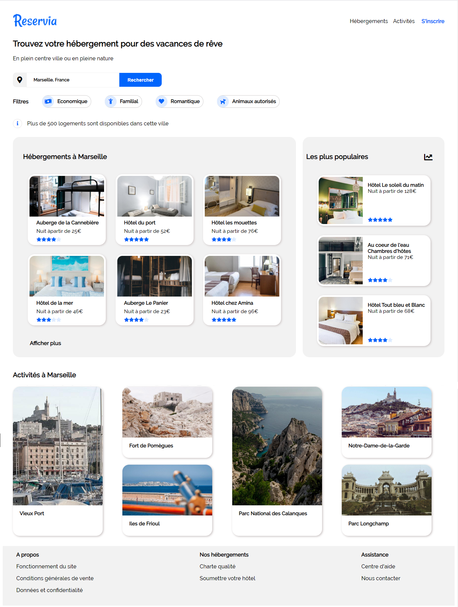

# PROJET 2 - Transformez une maquette en site web

Le site permet aux usagers de trouver des hébergements et des activités dans la ville de leur choix. 

Il s'agit d'intégrer une maquette en page web responsive. Filtres, boutons et liens ne sont pas fonctionnels.

## Langages utilisés:

- HTML
- CSS

